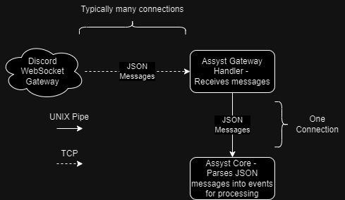

# assyst-gateway

This is the basic HTTP connection to the Discord WebSocket gateway, in order to receive messages (known as events in Discord) for processing. These messages include messages being sent, updated (such as being edited), deleted, as well as other events such as the bot joining a new guild, being removed from a guild, or a shard (an individual connection - see below) becoming ready to receive events.

The communication through the Discord WebSocket gateway is fairly complex, expecially for large bots that are in many Discord guilds. The details of the low-level communication are abstracted away by the Discord libaray Assyst uses (https://crates.io/crates/twilight-gateway), but there are still some components that must be considered.

One of the key considerations of the design for Assyst2 is very reliable operation, including fast restarts. The production instance of Assyst is present in many thousands of guilds, and as such can process hundreds of events per second. Usually, this is far too much for a single WebSocket connection to cope with, so communication with Discord is divided into multiple WebSocket connections known as *shards*. The issue is that shards have a certain 'startup time' and only one can start at once, meaning that for a large instance, this gateway process can take several minutes to fully connect to Discord - not ideal.

As a result, this crate exists to allow updates and restarts to other parts of the Assyst infrastructure (primarily assyst-core, for command updates) without forcing a reconnection to the Discord WebSocket gateway, allowing much faster updates.

When messages are received by the Assyst gateway, they are immediately sent via a UNIX pipe (`UnixStream` in Tokio) for parsing and processing. In addition, when the core restarts or crashes, messages are buffered for when the core reconnects. This way, no messages are lost and so in theory, updates to the core should have zero percieved downtime.